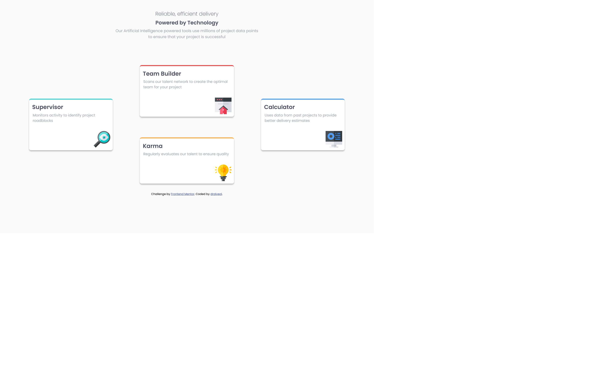
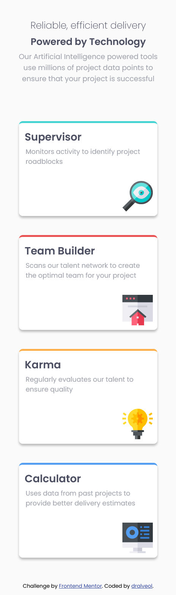

# Frontend Mentor - Four card feature section solution

This is a solution to the [Four card feature section challenge on Frontend Mentor](https://www.frontendmentor.io/challenges/four-card-feature-section-weK1eFYK). Frontend Mentor challenges help you improve your coding skills by building realistic projects. 

## Table of contents

- [Overview](#overview)
  - [The challenge](#the-challenge)
  - [Screenshot](#screenshot)
  - [Links](#links)
- [My process](#my-process)
  - [Built with](#built-with)
  - [What I learned](#what-i-learned)
  - [Continued development](#continued-development)
  - [Useful resources](#useful-resources)
- [Author](#author)
- [Acknowledgments](#acknowledgments)


## Overview

### The challenge

Users should be able to:

- View the optimal layout for the site depending on their device's screen size

### Screenshot




### Links

- Solution URL: [Repository](https://github.com/dralveol/four-card-feature-section-master)
- Live Site URL: [Live site](https://dralveol.io/four-card-feature-section-master)

## My process

### Built with

- Semantic HTML5 markup
- CSS custom properties
- Flexbox
- Mobile-first workflow

### What I learned

Tried using rem, % as much as i could instead of pixels.
Flexbox is a simple and flexible layout method. The challenge was not that easy.


```html
<section class="central-desktop-column">
      <article class="card" id="team-builder">
      <h3>Team Builder</h3>
      <p>Scans our talent network to create the optimal team for your project</p>
      
    </article>
    <article class="card" id="karma">
      <h3>Karma</h3>
      <p>Regularly evaluates our talent to ensure quality</p>
      
    </article>
</section>
```
```css
  .central-desktop-column {
    display: flex;
    flex-direction: column;
    align-items: center;
    justify-content: center;
  }
```


### Continued development

This was a first try solution with flex (and btw i need to learn much more on the flexbox) but i don't know if it's the appropriate method for the challenge. 

## Author


- Frontend Mentor - [@dralveol](https://www.frontendmentor.io/profile/dralveol)


